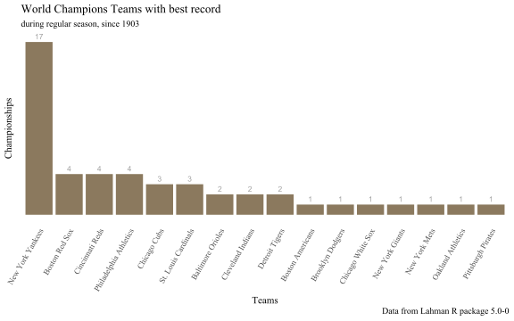
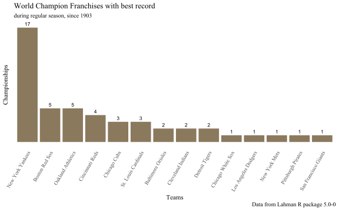
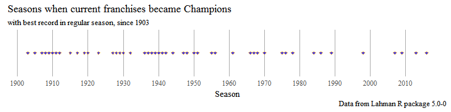
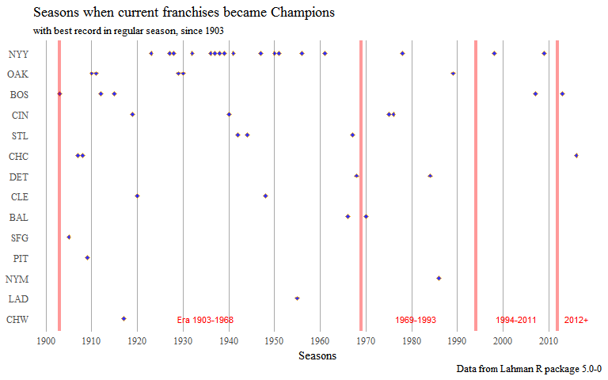
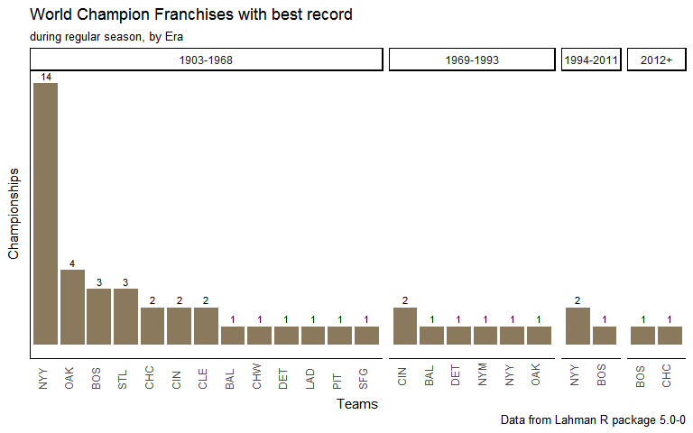
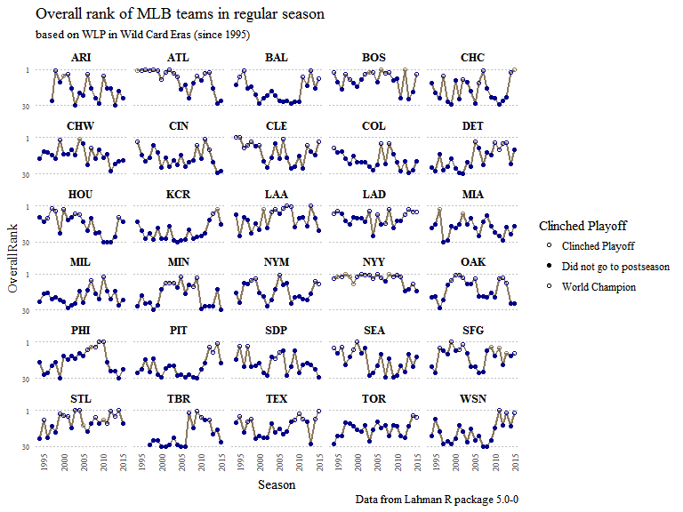

### Some reasons for this

This year the [Chicago Cubs](http://www.cubs.com) became the MLB *World
Series Champions*, defeating the Cleveland Indians in a heartbreaking
7th game of the serie.

In 2016 the Cubs were also the team with the best record (number of
wins) in all the Major Leagues.

Contrary to European Soccer (where teams play just a regular season and
the one with best record becomes the league champion), in baseball, it's
doesn't seem to be so frequent that the team with the best record is
always the ones that achieves the Commissioner's Trophy. This can be due
to the fact that MLB, as any other sports leagues in America, has a
playoff phase, on which teams that clinched the postseason have to play
series against other team and win it in order to advance to next phases.

That's why I was curious after the end of the 2016 World Series to know
how frequently a MLB team with the best record in the regular season,
which could lead to think that it was the best team in the season,
becomes the World Champion.

I used the "*Lahman*" R package as it has data of all MLB teams by
season and it could be what I need to answer this question and maybe
find some other insights about this. So, let's play with the data.

First I loaded the packages used in the analysis.

    # Loading the packages for the analysis
    library(Lahman)
    library(tidyverse)
    library(plotly)
    library(readxl)
    library(knitr)
    library(ggthemes)
    library(svglite)

### Data acquisition and manipulation

#### Data acquisition

Using the table called `Teams` (Yearly Stats and Standings) from the
[Lahman package](http://lahman.r-forge.r-project.org/), I created a
[*tibble*](https://blog.rstudio.org/2016/03/24/tibble-1-0-0/) with a
subset of it and called it `TeamsStd` (from Teams Standings). I selected
just a few columns from the original table. You can check the meaning of
each of the selected columns
[here](http://lahman.r-forge.r-project.org/doc/).

    TeamsStd <- tbl_df(Teams) %>%
      select(yearID, lgID, divID, Rank, W, L, DivWin, WCWin, LgWin, WSWin, name, teamIDBR)

So, printing a summary of the new `TeamsStd` tibble, we have:

    summary(TeamsStd)

    ##      yearID     lgID         divID                Rank       
    ##  Min.   :1871   AA:  85   Length:2805        Min.   : 1.000  
    ##  1st Qu.:1919   AL:1205   Class :character   1st Qu.: 2.000  
    ##  Median :1963   FL:  16   Mode  :character   Median : 4.000  
    ##  Mean   :1955   NA:  50                      Mean   : 4.107  
    ##  3rd Qu.:1992   NL:1429                      3rd Qu.: 6.000  
    ##  Max.   :2015   PL:   8                      Max.   :13.000  
    ##                 UA:  12                                      
    ##        W                L             DivWin             WCWin          
    ##  Min.   :  0.00   Min.   :  4.00   Length:2805        Length:2805       
    ##  1st Qu.: 66.00   1st Qu.: 65.00   Class :character   Class :character  
    ##  Median : 77.00   Median : 76.00   Mode  :character   Mode  :character  
    ##  Mean   : 74.75   Mean   : 74.75                                        
    ##  3rd Qu.: 87.00   3rd Qu.: 87.00                                        
    ##  Max.   :116.00   Max.   :134.00                                        
    ##                                                                         
    ##     LgWin              WSWin               name          
    ##  Length:2805        Length:2805        Length:2805       
    ##  Class :character   Class :character   Class :character  
    ##  Mode  :character   Mode  :character   Mode  :character  
    ##                                                          
    ##                                                          
    ##                                                          
    ##                                                          
    ##    teamIDBR        
    ##  Length:2805       
    ##  Class :character  
    ##  Mode  :character  
    ##                    
    ##                    
    ##                    
    ## 

#### Data manipulation

Fom the summary, it can be seen that `TeamsStd` has info from 1871 up to
2015. Nevertheless, the [World Series started on
1903](https://en.wikipedia.org/wiki/World_Series), so let's subset
`TeamsStd` to have the data from 1903 to 2015.

    TeamsStd <- TeamsStd %>%
      filter(yearID >= 1903)

Let's add other variables to the tibble with `Winning-Loss Percentage`
(called WLP) and `Total of Games` (called G), and let's order the rows
per year based on their `WLP`, in descending order.

    TeamsStd <- mutate(TeamsStd,
              WLP = W/(W+L),
              G = W+L) %>%
      arrange(yearID, desc(WLP))

Now that the tibble is ordered by year and `WLP`, let's add a new
variable with the overall rank (called `OverallRank`) for each team on
each regular season, defining number 1 to the team with the best record,
2 for the second one and so on.

    TeamsStd <- mutate(TeamsStd,
             OverallRank = ave(WLP, yearID, FUN = seq_along))

Now `TeamsStd` has the info up to 2015. As the Lahman package is not yet
updated with the 2016 data, in order to include the last World Series, I
had to look for the 2016 data into [baseball
reference](http://www.baseball-reference.com/leagues/MLB/2016-standings.shtml),
built an Excel file (called `T2016.xlsx`) with the same variables than
`TeamsStd` and then bind them together.

    TeamsStd <- rbind(TeamsStd, T2016)

Additionally, to prepare better `TeamsStd` for the analysis, let's
modify some of the `classes` of the variables and give better names to
some of them:

    TeamsStd$WLP <- as.numeric(TeamsStd$WLP)
    TeamsStd$yearID <- as.integer(TeamsStd$yearID)
    TeamsStd$Rank <- as.factor(TeamsStd$Rank)
    TeamsStd$W <- as.integer(TeamsStd$W)
    TeamsStd$L <- as.integer(TeamsStd$L)
    TeamsStd$G <- as.integer(TeamsStd$G)
    TeamsStd$OverallRank <- as.factor(TeamsStd$OverallRank)
    TeamsStd <- TeamsStd %>% rename(Season = yearID, League = lgID, Team = name)
    TeamsStd <- mutate(TeamsStd,
                       Era = ifelse(Season <= 1968, "1903-1968",
                                ifelse(Season >= 1969 & Season < 1994, "1969-1993",
                                       ifelse(Season >= 1994 & Season < 2012, "1994-2011", "2012+"))))
    TeamsStd$Era <- as.factor(TeamsStd$Era)

Now `TeamsStd` has data from 1903 to 2016, which is the period of
analysis I want, and from where the exploratory analysis will begin.
`TeamsStd` has now the following view (subset of the 2016 season).

    knitr::kable(TeamsStd %>% slice(2391:2400), caption = "Subset of TeamsStd")

<table>
<caption>Subset of TeamsStd</caption>
<thead>
<tr class="header">
<th align="right">Season</th>
<th align="left">League</th>
<th align="left">divID</th>
<th align="left">Rank</th>
<th align="right">W</th>
<th align="right">L</th>
<th align="left">DivWin</th>
<th align="left">WCWin</th>
<th align="left">LgWin</th>
<th align="left">WSWin</th>
<th align="left">Team</th>
<th align="left">teamIDBR</th>
<th align="right">WLP</th>
<th align="right">G</th>
<th align="left">OverallRank</th>
<th align="left">Era</th>
</tr>
</thead>
<tbody>
<tr class="odd">
<td align="right">2016</td>
<td align="left">NL</td>
<td align="left">C</td>
<td align="left">1</td>
<td align="right">103</td>
<td align="right">58</td>
<td align="left">Y</td>
<td align="left">N</td>
<td align="left">Y</td>
<td align="left">Y</td>
<td align="left">Chicago Cubs</td>
<td align="left">CHC</td>
<td align="right">0.640</td>
<td align="right">161</td>
<td align="left">1</td>
<td align="left">2012+</td>
</tr>
<tr class="even">
<td align="right">2016</td>
<td align="left">AL</td>
<td align="left">W</td>
<td align="left">1</td>
<td align="right">95</td>
<td align="right">67</td>
<td align="left">Y</td>
<td align="left">N</td>
<td align="left">N</td>
<td align="left">N</td>
<td align="left">Texas Rangers</td>
<td align="left">TEX</td>
<td align="right">0.586</td>
<td align="right">162</td>
<td align="left">2</td>
<td align="left">2012+</td>
</tr>
<tr class="odd">
<td align="right">2016</td>
<td align="left">NL</td>
<td align="left">E</td>
<td align="left">1</td>
<td align="right">95</td>
<td align="right">67</td>
<td align="left">Y</td>
<td align="left">N</td>
<td align="left">N</td>
<td align="left">N</td>
<td align="left">Washington Nationals</td>
<td align="left">WSN</td>
<td align="right">0.586</td>
<td align="right">162</td>
<td align="left">3</td>
<td align="left">2012+</td>
</tr>
<tr class="even">
<td align="right">2016</td>
<td align="left">AL</td>
<td align="left">C</td>
<td align="left">1</td>
<td align="right">94</td>
<td align="right">67</td>
<td align="left">Y</td>
<td align="left">N</td>
<td align="left">Y</td>
<td align="left">N</td>
<td align="left">Cleveland Indians</td>
<td align="left">CLE</td>
<td align="right">0.584</td>
<td align="right">161</td>
<td align="left">4</td>
<td align="left">2012+</td>
</tr>
<tr class="odd">
<td align="right">2016</td>
<td align="left">AL</td>
<td align="left">E</td>
<td align="left">1</td>
<td align="right">93</td>
<td align="right">69</td>
<td align="left">Y</td>
<td align="left">N</td>
<td align="left">N</td>
<td align="left">N</td>
<td align="left">Boston Red Sox</td>
<td align="left">BOS</td>
<td align="right">0.574</td>
<td align="right">162</td>
<td align="left">5</td>
<td align="left">2012+</td>
</tr>
<tr class="even">
<td align="right">2016</td>
<td align="left">NL</td>
<td align="left">W</td>
<td align="left">1</td>
<td align="right">91</td>
<td align="right">71</td>
<td align="left">Y</td>
<td align="left">N</td>
<td align="left">N</td>
<td align="left">N</td>
<td align="left">Los Angeles Dodgers</td>
<td align="left">LAD</td>
<td align="right">0.562</td>
<td align="right">162</td>
<td align="left">6</td>
<td align="left">2012+</td>
</tr>
<tr class="odd">
<td align="right">2016</td>
<td align="left">AL</td>
<td align="left">E</td>
<td align="left">3</td>
<td align="right">89</td>
<td align="right">73</td>
<td align="left">N</td>
<td align="left">Y</td>
<td align="left">N</td>
<td align="left">N</td>
<td align="left">Toronto Blue Jays</td>
<td align="left">TOR</td>
<td align="right">0.549</td>
<td align="right">162</td>
<td align="left">7</td>
<td align="left">2012+</td>
</tr>
<tr class="even">
<td align="right">2016</td>
<td align="left">AL</td>
<td align="left">E</td>
<td align="left">2</td>
<td align="right">89</td>
<td align="right">73</td>
<td align="left">N</td>
<td align="left">Y</td>
<td align="left">N</td>
<td align="left">N</td>
<td align="left">Baltimore Orioles</td>
<td align="left">BAL</td>
<td align="right">0.549</td>
<td align="right">162</td>
<td align="left">8</td>
<td align="left">2012+</td>
</tr>
<tr class="odd">
<td align="right">2016</td>
<td align="left">NL</td>
<td align="left">E</td>
<td align="left">2</td>
<td align="right">87</td>
<td align="right">75</td>
<td align="left">N</td>
<td align="left">Y</td>
<td align="left">N</td>
<td align="left">N</td>
<td align="left">New York Mets</td>
<td align="left">NYM</td>
<td align="right">0.537</td>
<td align="right">162</td>
<td align="left">9</td>
<td align="left">2012+</td>
</tr>
<tr class="even">
<td align="right">2016</td>
<td align="left">NL</td>
<td align="left">W</td>
<td align="left">2</td>
<td align="right">87</td>
<td align="right">75</td>
<td align="left">N</td>
<td align="left">Y</td>
<td align="left">N</td>
<td align="left">N</td>
<td align="left">San Francisco Giants</td>
<td align="left">SFG</td>
<td align="right">0.537</td>
<td align="right">162</td>
<td align="left">10</td>
<td align="left">2012+</td>
</tr>
</tbody>
</table>

### Exploratory Analysis

Let's start by printing again a summary of `TeamsStd`:

    summary(TeamsStd)

    ##      Season     League       divID                Rank           W        
    ##  Min.   :1903   AA:   0   Length:2420        2      :382   Min.   : 36.0  
    ##  1st Qu.:1939   AL:1204   Class :character   4      :375   1st Qu.: 69.0  
    ##  Median :1973   FL:  16   Mode  :character   1      :372   Median : 79.0  
    ##  Mean   :1967   NA:   0                      3      :371   Mean   : 78.3  
    ##  3rd Qu.:1996   NL:1200                      5      :347   3rd Qu.: 88.0  
    ##  Max.   :2016   PL:   0                      6      :248   Max.   :116.0  
    ##                 UA:   0                      (Other):325                  
    ##        L            DivWin             WCWin              LgWin          
    ##  Min.   : 36.0   Length:2420        Length:2420        Length:2420       
    ##  1st Qu.: 69.0   Class :character   Class :character   Class :character  
    ##  Median : 78.0   Mode  :character   Mode  :character   Mode  :character  
    ##  Mean   : 78.3                                                           
    ##  3rd Qu.: 88.0                                                           
    ##  Max.   :120.0                                                           
    ##                                                                          
    ##     WSWin               Team             teamIDBR              WLP        
    ##  Length:2420        Length:2420        Length:2420        Min.   :0.2353  
    ##  Class :character   Class :character   Class :character   1st Qu.:0.4444  
    ##  Mode  :character   Mode  :character   Mode  :character   Median :0.5040  
    ##                                                           Mean   :0.5000  
    ##                                                           3rd Qu.:0.5584  
    ##                                                           Max.   :0.7632  
    ##                                                                           
    ##        G          OverallRank          Era      
    ##  Min.   :102.0   1      : 114   1903-1968:1102  
    ##  1st Qu.:154.0   2      : 114   1969-1993: 636  
    ##  Median :161.0   3      : 114   1994-2011: 532  
    ##  Mean   :156.6   4      : 114   2012+    : 150  
    ##  3rd Qu.:162.0   5      : 114                   
    ##  Max.   :165.0   6      : 114                   
    ##                  (Other):1736

#### Some facts from the summary view:

The maximum wins a team has achieved in a single season is 116. Let's
see which team was and if it became World Champions that season.

    knitr::kable(TeamsStd %>%
      filter(W == 116) %>%
      select(Season, League, OverallRank, Team, G, W, L, WLP, LgWin, WSWin))

<table>
<thead>
<tr class="header">
<th align="right">Season</th>
<th align="left">League</th>
<th align="left">OverallRank</th>
<th align="left">Team</th>
<th align="right">G</th>
<th align="right">W</th>
<th align="right">L</th>
<th align="right">WLP</th>
<th align="left">LgWin</th>
<th align="left">WSWin</th>
</tr>
</thead>
<tbody>
<tr class="odd">
<td align="right">1906</td>
<td align="left">NL</td>
<td align="left">1</td>
<td align="left">Chicago Cubs</td>
<td align="right">152</td>
<td align="right">116</td>
<td align="right">36</td>
<td align="right">0.7631579</td>
<td align="left">Y</td>
<td align="left">N</td>
</tr>
<tr class="even">
<td align="right">2001</td>
<td align="left">AL</td>
<td align="left">1</td>
<td align="left">Seattle Mariners</td>
<td align="right">162</td>
<td align="right">116</td>
<td align="right">46</td>
<td align="right">0.7160494</td>
<td align="left">N</td>
<td align="left">N</td>
</tr>
</tbody>
</table>

So, there was not only one team, but two with the highest number of won
games during a regular season, from 1903 to 2016. None of both teams
could became the World Champions those seasons, as shown in the previous
table `WSWin = N`.

Curiously, the Chicago Cubs played the World Series `LgWin = Y` but they
lost against the Chicago White Sox on 1906.

#### Which are the teams with best record in the regular season and that have won the World Series, since 1903?

To do this, I took a subset of the `TeamsStd` with the teams with the
best `WLP` (best record) that became the World Champions (`WSWin = Y`)
and save it as a new tibble, called `Best_Champs`.

    Best_Champs <- TeamsStd %>%
      filter(OverallRank == 1 & WSWin == "Y")
    sort(table(Best_Champs$Team), decreasing = TRUE)

    ## 
    ##       New York Yankees         Boston Red Sox        Cincinnati Reds 
    ##                     17                      4                      4 
    ## Philadelphia Athletics           Chicago Cubs    St. Louis Cardinals 
    ##                      4                      3                      3 
    ##      Baltimore Orioles      Cleveland Indians         Detroit Tigers 
    ##                      2                      2                      2 
    ##       Boston Americans       Brooklyn Dodgers      Chicago White Sox 
    ##                      1                      1                      1 
    ##        New York Giants          New York Mets      Oakland Athletics 
    ##                      1                      1                      1 
    ##     Pittsburgh Pirates 
    ##                      1

It seems that the New York Yankees are used to this kind of seasons, as
17 out of their [27 World
Series](https://en.wikipedia.org/wiki/List_of_World_Series_champions)
titles have occurred when they were the best team in the regular season.
The following bar plot shows all these teams with their total of
championships in that condition. This has occurred 48 times since 1903.

The bar plot clearly shows the dominance of the Yankees within this
group. Indeed, no other team is near to achieve that level in the short
term. On the other hand the Chicago Cubs, with their 2016 championship,
has made this (World Champion after having the best record) for the
third time in their history (since 1903).

Note that the [Boston
Americans](http://www.baseball-reference.com/teams/BOS/) became the
Boston RedSox in 1907. Since 1958, the [Brooklyn
Dodgers](http://www.baseball-reference.com/teams/LAD/) are the LA
Dodgers, and the [NY
Giants](http://www.baseball-reference.com/teams/SFG/) are the SF Giants.
The Oakland Athletics were the old [Philadelphia
Athletics](http://www.baseball-reference.com/teams/OAK/) from 1901 to
1954.

So redefining the tibble to show the current Franchises, the bar plot
can be reorganized to show the total of championships by current
Franchises:

Boston Red Sox, Oakland Athletics, Cincinnati Reds and Chicago Cubs sum
up the same 17 titles of the NY Yankees on those conditions.

#### When do those 48 championships occurred since 1903?

This plot suggest that this occurred more frequently between 1930 and
1950 than in the last decades. For example in the current century it has
occurred just four times, including this year.

This could have some relation with the different format of postseasons
along the history. Since 1903, [four different postseasons formats has
been
implemented](https://en.wikipedia.org/wiki/Major_League_Baseball_postseason#Format_history),
where more rounds has been added in the postseason along the time, when
the leagues were expaned with more teams.

##### Era 1903-1968:

For example, between 1903 and 1968, just one postseason round was played
between the American League and National League Champions. That round
was the itself the World Series.

On this format, if considering that both teams had evenly chances to win
the *World Series (WS)*, theoretically 50% of the time the team with
best record should became the World Champion.

##### Era 1969-1993:

From 1969 to 1993 a new round, previous to the World Series was added to
the postseason. That round was called the *League Championship Series
(LCS)*, and it was because both leagues expanded to twelve teams each
and the leagues were subdivided into two divisions, the West and
Central. The LCS was played, by league, between the teams with first
place in the West Division and East Division.

On this format, if considering that the four teams had evenly chances to
win the LCS and WS, theoretically 25% of the time the team with best
record should became the World Champion (as the team with best record
would have 50% of wining the LCS and 50% of winning the WS, thus as both
events are independent, the probabilities are multipled).

##### Era 1994-2011:

On this Era the leagues were divided into three divisions, West, East
and Central. Nevertheless, using only the divisional winners to advance
to the postseason would make an odd number of teams in each league; so a
fourth team was needed to rectify that situation. Then it was when the
*Wild Card (WC)* team born in the MLB, allowing the second-best team on
each league make the postseason, even if it was not a Division Champion.

This provoked that four teams on each league joined the postseason and a
new round of was needed to define the two teams that would playe the
LCS. This new round was called the *Division Series (DS)*.

On this format, if considering that the eight teams had evenly chances
to win the DS, LCS and WS, theoretically 12.5% of the time the team with
best record should became the World Champion (as in the previous era,
adding a new round provoked the team with best record to play an
addional series, so the team with best record would have 50% of changes
to win the DS, 50% of winning the LCS, and 50% of winning the WS, thus
as all three events are independent, the probabilities are also
multipled).

##### Era 2012 to present:

This is the current postseason format and the difference with the
1994-2011 era is that an additional round was added only for the Wild
Card teams, where the two teams qualify as WC, they play a one-game
playoff and the winner advances to the DS.

On this format the team with best record does not have to play an
additional round, so its probability reamins the same, 12.5% as in the
previous era.

The following image summarizes these formats: \#\#\# ABC

So let's plot again the previous graph but differentiating the Eras:

From 1903 to 2016, 112 World Series has been celebrated between the
National and the American League Champions (there were no WS in 1904 and
1994). **That's equivalent to say that the best team in a regular season
became World Champion in 43% of the time (48 out of 112).**.

Checking that situation based on the Era, we have:

    Best_Champs$frID_Era <- with(Best_Champs, paste(FranchID, Era, sep = "_"))

      
    Best_Champs <- within(Best_Champs,
                           frID_Era <- factor(frID_Era,
                                          levels = names(sort(table(frID_Era), decreasing = TRUE))))

    brt_WS <- ggplot(Best_Champs, aes(x = frID_Era)) +
      geom_bar(stat = "count", fill = "navajowhite4") +
      geom_text(stat="count", aes(label=..count..), vjust=-.5, size = 3) +
      labs(title = "World Champion Franchises with best record",
           subtitle = "during regular season, by Era",
           caption = "Data from Lahman R package 5.0-0",
           x = "Teams",
           y = "Championships") +
      theme_classic() +
      facet_grid(. ~ Era, scale = "free", space = "free") +
      theme(axis.text.x=element_text(angle = 90, hjust = 0, vjust = 0, size = 9),
            axis.text.y=element_blank(),
            axis.ticks = element_blank()) +
      scale_x_discrete("Teams", breaks = Best_Champs$frID_Era, label = Best_Champs$FranchID)
      #geom_text(label=Best_Champs$FranchID,angle=90,size=3)+
    brt_WS

So, in the last two formats (Wild Card Eras), only five times it has
occurred being made by only three teams.

<table>
<caption>World Champions with best record in the Wild Card era</caption>
<thead>
<tr class="header">
<th align="right">Season</th>
<th align="left">League</th>
<th align="left">OverallRank</th>
<th align="left">Team</th>
<th align="right">W</th>
<th align="right">L</th>
<th align="right">WLP</th>
</tr>
</thead>
<tbody>
<tr class="odd">
<td align="right">1998</td>
<td align="left">AL</td>
<td align="left">1</td>
<td align="left">New York Yankees</td>
<td align="right">114</td>
<td align="right">48</td>
<td align="right">0.7037037</td>
</tr>
<tr class="even">
<td align="right">2007</td>
<td align="left">AL</td>
<td align="left">1</td>
<td align="left">Boston Red Sox</td>
<td align="right">96</td>
<td align="right">66</td>
<td align="right">0.5925926</td>
</tr>
<tr class="odd">
<td align="right">2009</td>
<td align="left">AL</td>
<td align="left">1</td>
<td align="left">New York Yankees</td>
<td align="right">103</td>
<td align="right">59</td>
<td align="right">0.6358025</td>
</tr>
<tr class="even">
<td align="right">2013</td>
<td align="left">AL</td>
<td align="left">1</td>
<td align="left">Boston Red Sox</td>
<td align="right">97</td>
<td align="right">65</td>
<td align="right">0.5987654</td>
</tr>
<tr class="odd">
<td align="right">2016</td>
<td align="left">NL</td>
<td align="left">1</td>
<td align="left">Chicago Cubs</td>
<td align="right">103</td>
<td align="right">58</td>
<td align="right">0.6400000</td>
</tr>
</tbody>
</table>

    TeamsStd <- mutate(TeamsStd,
                          FranchID = ifelse(teamIDBR == "ANA" | teamIDBR == "CAL" | teamIDBR == "LAA", "LAA",
                                            ifelse(teamIDBR == "FLA" | teamIDBR == "MIA", "MIA",
                                                   ifelse(teamIDBR == "MON" | teamIDBR == "WAS" | teamIDBR == "WSN", "WSN",
                                                          ifelse(teamIDBR == "TBD" | teamIDBR == "TBR", "TBR",
                                                                 teamIDBR)
                                                   )
                                            )
                          ),
                          clinch_ps = ifelse((DivWin == "Y" | WCWin == "Y") & WSWin == "N", "Clinched Playoff",
                                          ifelse(WSWin == "Y", "World Champion", "Did not go to postseason"))
    )
      
                       
    TeamsOverall <- TeamsStd %>%
      filter(Season >= 1995)

    TeamsOverall$OverallRank <- as.integer(TeamsOverall$OverallRank)

    Overall_Linegraph <- ggplot(TeamsOverall, aes(x = Season, y = OverallRank)) +
      geom_line(color = "navajowhite4", size = .8) +
      geom_point(aes(color = clinch_ps, shape = clinch_ps)) +
      guides(color = FALSE) +
      scale_colour_manual(breaks = c("Clinched Playoff", "World Champion", "Did not go to postseason"),  
                         values = c("darkblue", "darkblue", "navajowhite4")) +
      scale_shape_manual(c("Clinched Playoff", "World Champion", "Did not go to postseason"),  
                         values = c(21, 19, 1)) +
      scale_y_reverse(breaks = c(1,30)) +
      facet_wrap(~ FranchID, ncol = 5) +
      labs(title = "Overall rank of MLB teams in regular season",
           subtitle = "based on WLP in Wild Card Eras (since 1995)",
           caption = "Data from Lahman R package 5.0-0")+
      theme_tufte() +
      theme(axis.ticks = element_blank(),
            panel.grid.major.y = element_line(colour = "gray", linetype = "dotted", size = 0.1),
            panel.grid.minor.y = element_blank(),
              #panel.grid.minor = element_line(colour = "gray", linetype = "dotted", size = 0.3),
              #panel.grid.major = element_line(colour = "gray", linetype = "dotted", size = 0.1),
            strip.text.x = element_text(size = 10, family = "serif", face = "bold", colour = "black", angle = 0),
            axis.text.x=element_text(angle = 90, hjust = 0, vjust = 1, size = 7),
            axis.text.y=element_text(angle = 0, hjust = 1, vjust = 0.5, size = 6)) +
      scale_x_continuous(breaks = seq(1995, 2020, 5))

    Overall_Linegraph

svglite("Test.svg") Overall\_Linegraph dev.off()
