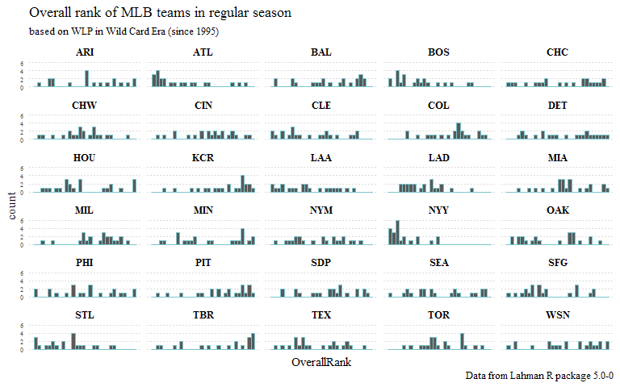

Overall ranking of MLB teams in regular season (Wild Card Era)
==============================================================

Loading needed packages
-----------------------

``` r
# Loading packages
 library(Lahman)  # To get the data
 library(dplyr)   # To ease the data manipulation
```

For this post, the overall rank of a team in a regular season of the MLB will be considered based on the Winning and Loss percentage of each team. So, the following variables are needed, for each seaosn, to create that `WLP` percentage: - The team name / ID; - The season; - Won games, and - Lost games;

This info is available into the `Teams` data frame of the Lahman R package. As the analysis is consiring just the Wild Card Eras, only data from 1994 will be taken:

``` r
# getting the data from lahman package: From 1995 to 2015
Teams_data <- tbl_df(Teams) %>%
  select(yearID, name, teamIDBR, W, L, DivWin, WCWin, WSWin) %>%
  filter(yearID >= 1994)
```

Let's add a variable with the Winning - Loss percentage, `WLP`, and order the tibble by `yearID` and `WLP` (in descending order).

``` r
Teams_data <- mutate(Teams_data,
        WLP = W/(W+L)) %>%
  arrange(yearID, desc(WLP))
```

Now that `Teams_data` is ordered, let's add a new variable with the overall rank (called `OverallRank`) for each team on each regular season, defining number 1 to the team with the best `WLP`, 2 for the team with the best second `WLP` and so on.

``` r
Teams_data <- mutate(Teams_data,
         OverallRank = ave(WLP, yearID, FUN = seq_along))
```

By the time of building this article, the R Lahman Package (in version 5.0-0) did not have the 2016 data. So, I went to [baseball-reference](www.baseball.reference.com) and built an excel table with this data, in order to be bound to the `Teams_data` tibble.

``` r
# get 2016 data from baseball-reference
library(readxl)  # To read into R Excel files

T2016 <- tbl_df(read_excel("C:/Users/1328/Documents/R projects/darh78.github.io/data/T2016.xlsx"))

# binding both tibbles
Teams_data <- rbind(Teams_data, T2016)
```

During this period, 4 franchises changed there names at least once, so let's standardize the ID of each team with franchises ID that played in 2016 season.

``` r
Teams_data <- mutate(Teams_data,
                  FranchID = ifelse(teamIDBR == "ANA" | teamIDBR == "CAL" | teamIDBR == "LAA", "LAA",
                                        ifelse(teamIDBR == "FLA" | teamIDBR == "MIA", "MIA",
                                               ifelse(teamIDBR == "MON" | teamIDBR == "WAS" | teamIDBR == "WSN", "WSN",
                                                      ifelse(teamIDBR == "TBD" | teamIDBR == "TBR", "TBR",
                                                             teamIDBR)
                                               )
                                        )
                      ))
```

Additionally, to better prepare `Teams_data` for the analysis, let's modify some of the `classes` of the variables and give better names to some of them:

``` r
Teams_data$WLP <- as.numeric(Teams_data$WLP)
Teams_data$yearID <- as.integer(Teams_data$yearID)
Teams_data$W <- as.integer(Teams_data$W)
Teams_data$L <- as.integer(Teams_data$L)
Teams_data$OverallRank <- as.integer(Teams_data$OverallRank)
Teams_data <- Teams_data %>% rename(Season = yearID, Team = name)
```

Having the tibble on this state:

``` r
knitr::kable(Teams_data %>% slice(c(1:2, 100:101, 300:310, 500:505)))
```

|  Season| Team                  | teamIDBR |    W|    L| DivWin | WCWin | WSWin |        WLP|  OverallRank| FranchID |
|-------:|:----------------------|:---------|----:|----:|:-------|:------|:------|----------:|------------:|:---------|
|    1994| Montreal Expos        | MON      |   74|   40| NA     | NA    | NA    |  0.6491228|            1| WSN      |
|    1994| New York Yankees      | NYY      |   70|   43| NA     | NA    | NA    |  0.6194690|            2| NYY      |
|    1997| Milwaukee Brewers     | MIL      |   78|   83| N      | N     | N     |  0.4844720|           16| MIL      |
|    1997| Boston Red Sox        | BOS      |   78|   84| N      | N     | N     |  0.4814815|           17| BOS      |
|    2004| Minnesota Twins       | MIN      |   92|   70| Y      | N     | N     |  0.5679012|            8| MIN      |
|    2004| Oakland Athletics     | OAK      |   91|   71| N      | N     | N     |  0.5617284|            9| OAK      |
|    2004| San Francisco Giants  | SFG      |   91|   71| N      | N     | N     |  0.5617284|           10| SFG      |
|    2004| Chicago Cubs          | CHC      |   89|   73| N      | N     | N     |  0.5493827|           11| CHC      |
|    2004| Texas Rangers         | TEX      |   89|   73| N      | N     | N     |  0.5493827|           12| TEX      |
|    2004| San Diego Padres      | SDP      |   87|   75| N      | N     | N     |  0.5370370|           13| SDP      |
|    2004| Philadelphia Phillies | PHI      |   86|   76| N      | N     | N     |  0.5308642|           14| PHI      |
|    2004| Chicago White Sox     | CHW      |   83|   79| N      | N     | N     |  0.5123457|           15| CHW      |
|    2004| Florida Marlins       | FLA      |   83|   79| N      | N     | N     |  0.5123457|           16| MIA      |
|    2004| Cleveland Indians     | CLE      |   80|   82| N      | N     | N     |  0.4938272|           17| CLE      |
|    2004| Baltimore Orioles     | BAL      |   78|   84| N      | N     | N     |  0.4814815|           18| BAL      |
|    2010| Arizona Diamondbacks  | ARI      |   65|   97| N      | N     | N     |  0.4012346|           28| ARI      |
|    2010| Seattle Mariners      | SEA      |   61|  101| N      | N     | N     |  0.3765432|           29| SEA      |
|    2010| Pittsburgh Pirates    | PIT      |   57|  105| N      | N     | N     |  0.3518519|           30| PIT      |
|    2011| Philadelphia Phillies | PHI      |  102|   60| Y      | N     | N     |  0.6296296|            1| PHI      |
|    2011| New York Yankees      | NYY      |   97|   65| Y      | N     | N     |  0.5987654|            2| NYY      |
|    2011| Milwaukee Brewers     | MIL      |   96|   66| Y      | N     | N     |  0.5925926|            3| MIL      |

Before ploting anything, let's see a summary of the variables: So, printing a summary of the new `TeamsStd` tibble, we have:

``` r
summary(Teams_data)
```

    ##      Season         Team             teamIDBR               W         
    ##  Min.   :1994   Length:682         Length:682         Min.   : 43.00  
    ##  1st Qu.:1999   Class :character   Class :character   1st Qu.: 71.00  
    ##  Median :2005   Mode  :character   Mode  :character   Median : 80.00  
    ##  Mean   :2005                                         Mean   : 79.61  
    ##  3rd Qu.:2011                                         3rd Qu.: 89.00  
    ##  Max.   :2016                                         Max.   :116.00  
    ##        L             DivWin             WCWin              WSWin          
    ##  Min.   : 40.00   Length:682         Length:682         Length:682        
    ##  1st Qu.: 71.00   Class :character   Class :character   Class :character  
    ##  Median : 79.00   Mode  :character   Mode  :character   Mode  :character  
    ##  Mean   : 79.61                                                           
    ##  3rd Qu.: 89.00                                                           
    ##  Max.   :119.00                                                           
    ##       WLP          OverallRank      FranchID        
    ##  Min.   :0.2654   Min.   : 1.00   Length:682        
    ##  1st Qu.:0.4506   1st Qu.: 8.00   Class :character  
    ##  Median :0.5000   Median :15.00   Mode  :character  
    ##  Mean   :0.5000   Mean   :15.34                     
    ##  3rd Qu.:0.5556   3rd Qu.:23.00                     
    ##  Max.   :0.7160   Max.   :30.00

Over this period, the maximum number of Wins by a team is 116, and the maxium number of losses is 119. Let's see who were those teams:

``` r
knitr::kable(Teams_data %>%
  filter(W == 116 | L == 119) %>%
  select(Season, Team, W, L, WLP, OverallRank))
```

|  Season| Team             |    W|    L|        WLP|  OverallRank|
|-------:|:-----------------|----:|----:|----------:|------------:|
|    2001| Seattle Mariners |  116|   46|  0.7160494|            1|
|    2003| Detroit Tigers   |   43|  119|  0.2654321|           30|

These two correspond also to the minumim and maximum `WLP` in this period.

Now, let's visualize how each team overall rank has been between 1994 and 2016.

``` r
library(ggplot2) # To visualize results
library(ggthemes)# To format vizes

Linegraph <- ggplot(Teams_data, aes(x = Season, y = OverallRank)) +
  geom_line(color = "cadetblue3", size = .8) +
  scale_y_reverse(breaks = c(1,30)) +
  facet_wrap(~ FranchID, ncol = 5) +
  labs(title = "Overall rank of MLB teams in regular season",
       subtitle = "based on WLP in the Wild Card Era (since 1994)",
       caption = "Data from Lahman R package 5.0-0")+
  theme_tufte() +
  theme(axis.ticks = element_blank(),
        panel.grid.major.y = element_line(colour = "gray86", linetype = "dotted", size = 0.1),
        panel.grid.minor.y = element_blank(),
        strip.text.x = element_text(size = 10, family = "serif", face = "bold", colour = "black", angle = 0),
        axis.text.x=element_text(angle = 90, hjust = 0, vjust = 1, size = 7),
        axis.text.y=element_text(angle = 0, hjust = 1, vjust = 0.5, size = 6)) +
  scale_x_continuous(breaks = c(1994, 2000, 2005, 2010, 2016))

Linegraph
```


This interesting sparkline-type viz shows some importante insights: - Arizona and Tampa Bay have records from 1998, when they joing the MLB; - The most consistent team over the whole period are is The New York Yankees; - Baltimore, Kansas City, Pittsburgh and Washington had very bad years for long time; - Most of the teams have ups and downs in the overall rank / WLP;

Now, let's see how these results in the overall rank allow teams to clinch the postseason and who became World Champs. First lets add a new variable, called `clinch` to know if the team

``` r
Teams_data <- mutate(Teams_data,
                     clinch = ifelse((DivWin == "Y" | WCWin == "Y") & WSWin == "N", "Clinched Playoff",
                                      ifelse(WSWin == "Y", "World Champion", NA)))
```

And let's add those results to the previous plot.

``` r
Linegraph_ps <- ggplot(Teams_data, aes(x = Season, y = OverallRank)) +
  geom_line(color = "cadetblue3", size = .8) +
  geom_point(aes(color = clinch, shape = clinch, fill = clinch)) +
  guides(fill = FALSE) +
  scale_shape_manual(name = "Regular season result",
                     breaks = c("Clinched Playoff", "World Champ"),
                     values = c(21, 19),
                     labels = c("Clinched Playoff", "Eliminated")) +
  scale_colour_manual(name = "Postseason result",
                      breaks = c("Clinched Play", "World Champion", NA),  
                      values = c("darkblue", "red3", "cadetblue3"),
                      labels = c("", "World Champion", "")) +
  scale_fill_manual(name = "Clinched Postseason",
                    breaks = c("Clinched Playoff", "World Champion", NA),  
                    values = c("white", "orange", NA)) +
  scale_y_reverse(breaks = c(1,30)) +
  facet_wrap(~ FranchID, ncol = 5) +
  labs(title = "Overall rank of MLB teams in regular season",
       subtitle = "based on WLP in Wild Card Era (since 1995)",
       caption = "Data from Lahman R package 5.0-0")+
  theme_tufte() +
  theme(axis.ticks = element_blank(),
        panel.grid.major.y = element_line(colour = "gray86", linetype = "dotted", size = 0.1),
        panel.grid.minor.y = element_blank(),
        strip.text.x = element_text(size = 10, family = "serif", face = "bold", colour = "black", angle = 0),
        axis.text.x=element_text(angle = 90, hjust = -2, vjust = 1, size = 7),
        axis.text.y=element_text(angle = 0, hjust = 1, vjust = 0.5, size = 6)) +
  scale_x_continuous(breaks = c(1994, 2000, 2005, 2010, 2016))


Linegraph_ps
```


``` r
#ggsave(file="Overall_Linegraph.svg", plot=Overall_Linegraph, width=8, height=5)
#ggsave(file="Overall_Linegraph.png", plot=Overall_Linegraph, width=8, height=5)
```

``` r
Overall_histograph <- ggplot(Teams_data) +
  geom_histogram(mapping = aes(x = OverallRank), binwidth = 1, color = "cadetblue3") +
  guides(color = FALSE) +
  facet_wrap(~ FranchID, ncol = 5) +
  labs(title = "Overall rank of MLB teams in regular season",
       subtitle = "based on WLP in Wild Card Era (since 1995)",
       caption = "Data from Lahman R package 5.0-0") +
  theme_tufte() +
  theme(axis.ticks = element_blank(),
        panel.grid.major.y = element_line(colour = "gray86", linetype = "dotted", size = 0.1),
        panel.grid.minor.y = element_blank(),
        strip.text.x = element_text(size = 10, family = "serif", face = "bold", colour = "black", angle = 0),
        axis.text.x=element_text(angle = 0, hjust = 1, vjust = 1, size = 7),
        axis.text.y=element_text(angle = 0, hjust = 1, vjust = 0.5, size = 6)) +
  scale_x_continuous(breaks = c(1, 10, 20, 30))

Overall_histograph
```


