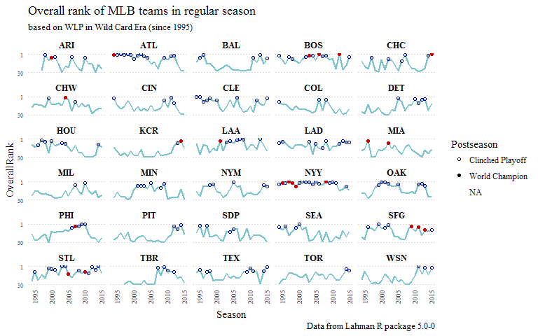

Loading needed packages
-----------------------

``` r
# Loading packages
library(Lahman)
library(dplyr)
library(ggplot2)
library(readxl)
library(ggthemes)
```

``` r
# getting the data from lahman package: From 1995 to 2015
Teams_data <- tbl_df(Teams) %>%
  select(yearID, lgID, divID, Rank, W, L, DivWin, WCWin, LgWin, WSWin, name, teamIDBR) %>%
  filter(yearID >= 1995)
```

Let's add a variable with the Winning - Loss percentage, `WLP`, and another with the total of games played, `G`. Lets order the tibble by `yearID` and `WLP` (in descending order).

``` r
Teams_data <- mutate(Teams_data,
          WLP = W/(W+L),
          G = W+L) %>%
  arrange(yearID, desc(WLP))
```

Now that `Teams_data` is ordered, let's add a new variable with the overall rank (called `OverallRank`) for each team on each regular season, defining number 1 to the team with the best `WLP`, 2 for the team with the best second `WPL` and so on.

``` r
Teams_data <- mutate(Teams_data,
         OverallRank = ave(WLP, yearID, FUN = seq_along))

# get 2016 data from baseball-reference
T2016 <- tbl_df(read_excel("C:/Users/1328/Documents/R projects/Best_Team_Champ/data/T2016.xlsx"))

# binding both tibbles
Teams_data <- rbind(Teams_data, T2016)
```

``` r
Teams_data <- mutate(Teams_data,
                  FranchID = ifelse(teamIDBR == "ANA" | teamIDBR == "CAL" | teamIDBR == "LAA", "LAA",
                                        ifelse(teamIDBR == "FLA" | teamIDBR == "MIA", "MIA",
                                               ifelse(teamIDBR == "MON" | teamIDBR == "WAS" | teamIDBR == "WSN", "WSN",
                                                      ifelse(teamIDBR == "TBD" | teamIDBR == "TBR", "TBR",
                                                             teamIDBR)
                                               )
                                        )
                      ),
                  clinch_ps = ifelse((DivWin == "Y" | WCWin == "Y") & WSWin == "N", "Clinched Playoff",
                                      ifelse(WSWin == "Y", "World Champion", NA))
)
```

Additionally, to better prepare `Teams_data` for the analysis, let's modify some of the `classes` of the variables and give better names to some of them:

``` r
Teams_data$WLP <- as.numeric(Teams_data$WLP)
Teams_data$yearID <- as.integer(Teams_data$yearID)
Teams_data$Rank <- as.factor(Teams_data$Rank)
Teams_data$W <- as.integer(Teams_data$W)
Teams_data$L <- as.integer(Teams_data$L)
Teams_data$G <- as.integer(Teams_data$G)
Teams_data$OverallRank <- as.factor(Teams_data$OverallRank)
Teams_data <- Teams_data %>% rename(Season = yearID, League = lgID, Team = name)
```

``` r
Teams_data$OverallRank <- as.integer(Teams_data$OverallRank)

Overall_Linegraph <- ggplot(Teams_data, aes(x = Season, y = OverallRank)) +
  geom_line(color = "cadetblue3", size = .8) +
  geom_point(aes(color = clinch_ps, shape = clinch_ps, fill = clinch_ps)) +
  guides(color = FALSE, fill = FALSE) +
  scale_shape_manual(c("Clinched Playoff", "World Champion", NA),  
                     values = c(21, 19, 1), guide = guide_legend(title = "Postseason")) +
  scale_colour_manual(breaks = c("Clinched Playoff", "World Champion", NA),  
                     values = c("darkblue", "red3", "cadetblue3")) +
  scale_fill_manual(breaks = c("Clinched Playoff", "World Champion", NA),  
                     values = c(NA, "orange", NA)) +
  scale_y_reverse(breaks = c(1,30)) +
  facet_wrap(~ FranchID, ncol = 5) +
  labs(title = "Overall rank of MLB teams in regular season",
       subtitle = "based on WLP in Wild Card Era (since 1995)",
       caption = "Data from Lahman R package 5.0-0")+
  theme_tufte() +
  theme(axis.ticks = element_blank(),
        panel.grid.major.y = element_line(colour = "gray86", linetype = "dotted", size = 0.1),
        panel.grid.minor.y = element_blank(),
        strip.text.x = element_text(size = 10, family = "serif", face = "bold", colour = "black", angle = 0),
        axis.text.x=element_text(angle = 90, hjust = 0, vjust = 1, size = 7),
        axis.text.y=element_text(angle = 0, hjust = 1, vjust = 0.5, size = 6)) +
  scale_x_continuous(breaks = seq(1995, 2020, 5))
  #scale_y_continuous(breaks = seq(0, 31, 1))

Overall_Linegraph
```



``` r
ggsave(file="Overall_Linegraph.svg", plot=Overall_Linegraph, width=8, height=5)
ggsave(file="Overall_Linegraph.png", plot=Overall_Linegraph, width=8, height=5)
```
